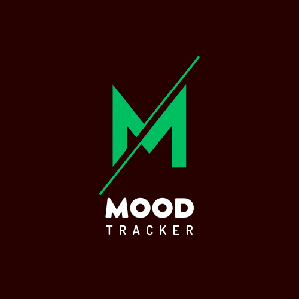
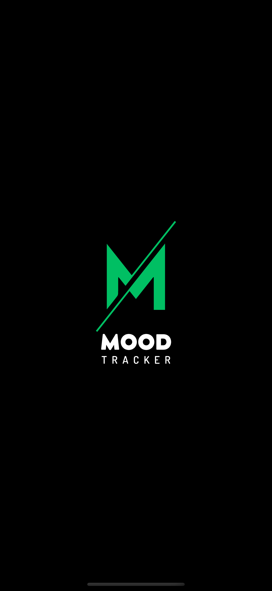
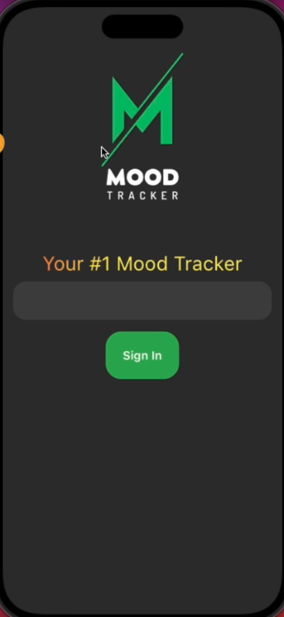
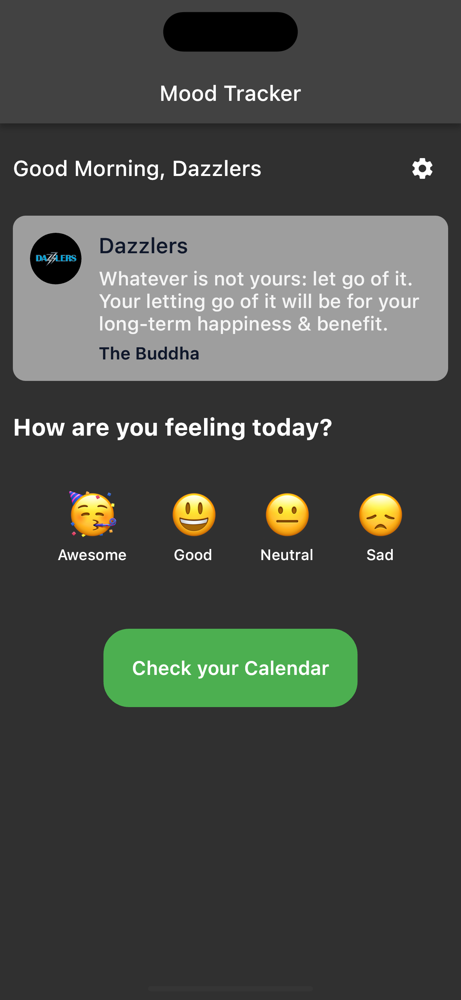
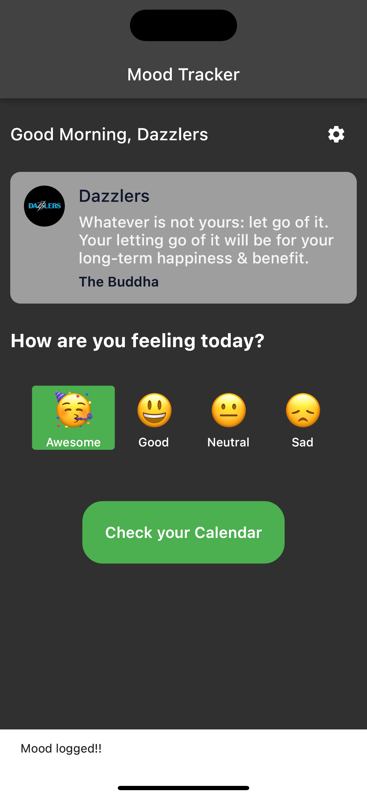
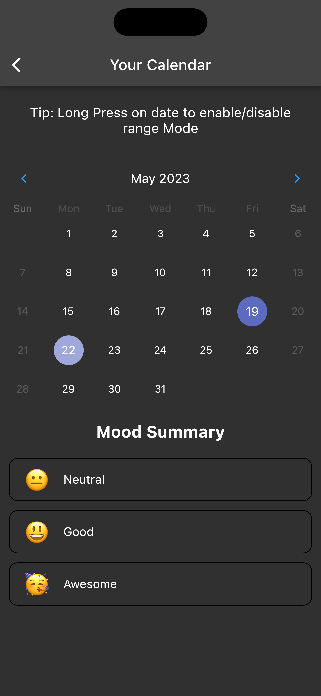
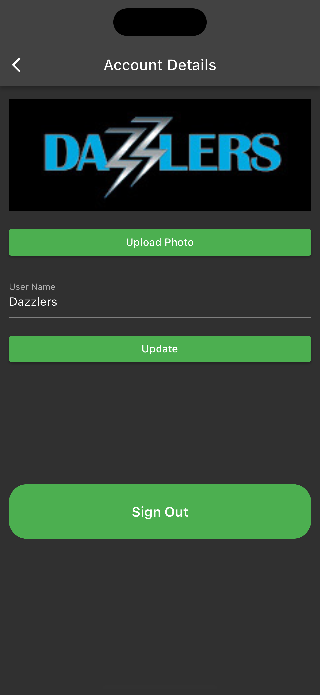

# MoodTracker 📖 🎯



The `MoodTracker` App is a powerful tool designed to help you track and understand your emotions, improve your mental well-being, and gain valuable insights into your mood patterns.

## Features

- **Track Your Moods**: Easily log your daily moods and emotions using a simple and intuitive interface. Choose from a wide range of predefined mood options that reflect your unique emotional states.
- **Visualize Your Mood History**: View your mood history from the interactive calendar. Gain insights into your emotional trends over time.
- **Secure and Private**: Your data is securely stored and encrypted, ensuring the privacy and confidentiality of your personal information.

This app demonstrates how to:

- sign users in with Supabase Auth using [magic link](https://supabase.io/docs/reference/dart/auth-signin#sign-in-with-magic-link)
- store and retrieve data with [Supabase database](https://supabase.io/docs/guides/database)
- store image files in [Supabase storage](https://supabase.io/docs/guides/storage)

## Why Use the MoodTracker App?

- **Enhance Self-Awareness**
- **Promote Emotional Well-being**
- **Track Progress**
- **Stay Motivated**

You can also access the `MoodTracker` on [web](https://moodtracker.flatteredwithflutter.com/)

## Video 🎥

[](https://www.youtube.com/watch?v=63vYleEf9vw)

## Screenshots

| Splash Screen                                                          | Login Screen                                                          | Home Screen                                                          |
| ---------------------------------------------------------------------- | --------------------------------------------------------------------- | -------------------------------------------------------------------- |
|  |  |  |

| Mood Record                                                                 | Calendar Screen                                                          | Profile Screen                                                          |
| --------------------------------------------------------------------------- | ------------------------------------------------------------------------ | ----------------------------------------------------------------------- |
|  |  |  |

## Getting Started 🚀

Before running this app, you need to create a Supabase project and copy [your credentials](https://supabase.io/docs/guides/with-flutter#get-the-api-keys) to `main.dart`

To get started with the project, follow these steps:

1. Clone the repository
2. Install dependencies:

```bash
flutter pub get
```

3. You can run this app on iOS, Android or the Web.

```bash
flutter run
```

Or for web, run the following command to launch it on `localhost:3000`

```bash
flutter run -d web-server --web-hostname localhost --web-port 3000
```

### Architecture 🏗🏗

- The app follows MVVM approach
- Their is a shared folder, which comprises of all the common entities.
- Common entites like assets, extensions, services etc

- Take a folder, let's say home
- It is broken down into components, models, utils (utilties if any), view and view_models

## Future Enhancements

Here are some potential future enhancements that can be implemented in this `MoodTracker` app:

1. **Data Visualization:** Incorporate interactive charts and graphs to visually represent mood data over time. This can provide users with a clear understanding of their emotional patterns and trends.
2. **Goal Setting:** Introduce a goal-setting feature where users can set and track goals related to their mood. This can include targets for achieving emotional well-being, managing stress, or practicing self-care activities.
3. **Mood Patterns Analysis:** Implement algorithms to analyze mood patterns and provide personalized insights and recommendations. This feature can help users identify triggers, patterns, and effective coping strategies based on their individual data.
4. **Reminders and Notifications:** Incorporate reminders and notifications to prompt users to log their mood at specific times throughout the day. This feature ensures consistent tracking and helps users maintain an accurate record of their emotional state.

Let's keep building and improving this `MoodTracker` app together! 🚀

## Contact 💡

If you have any questions or suggestions, feel free to reach out to `Team Dazzlers`:

- [Ruchi Dhar](https://twitter.com/ruchidhar007)
- [Aseem Wangoo](https://twitter.com/aseemwangoo)

We hope the `MoodTracker` App brings you greater self-awareness, emotional well-being, and happiness in your daily life!
